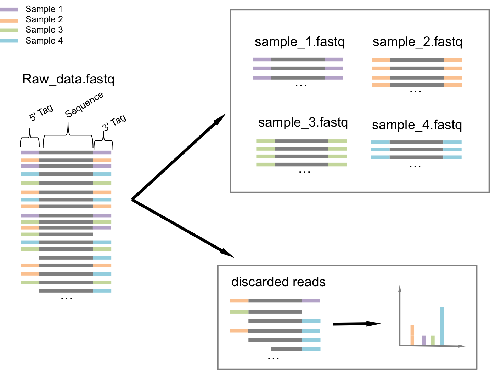
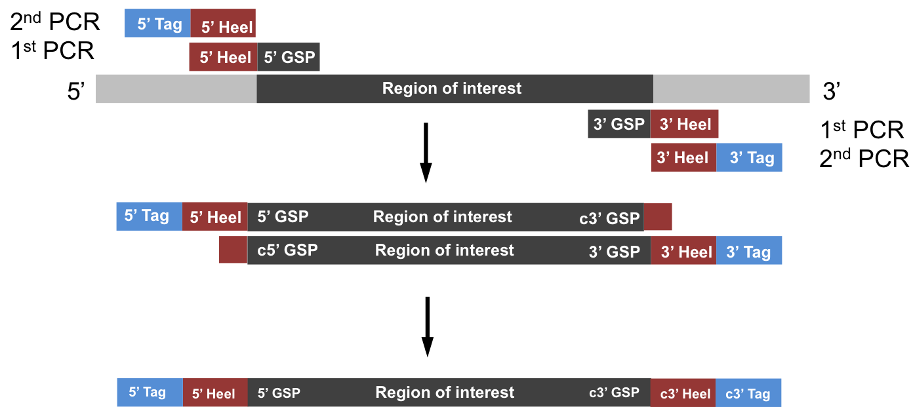

# hiplexdeplex
Tool suite to demultiplex hiplex data

## what is it?

it's a demultiplexer for sorting reads, such as from multiplexed samples from targeted-amplicon sequencing, based on their sequence tags.
It is capable of sorting out Chimeric reads and contains some base-quality and read-length filters, as well as some output statistics indicative of the success of the sequencing-process.
This should make it suitable for use as the only read-processing tool before aligning the reads to the reference genome.

 Written in Python 2.7, depends on Biopython

## how does work?
The demultiplexer works by taking the read-structure into account, which is a result of the sequencing stragety employed to create the data.
Due to the two-step PCR, all reads are structured the same way:
 They consist of the amplified region of interest, flanked on both sides with a primer-“heel” that is the same for all reads, and a sample-specific tag that is attached to all amplified regions of one sample.

# Usage:

python detag.py [-h] --tags TAGS --heel HEEL [--pairedfastq]
                       [--forward FORWARD] [--reverse REVERSE]
                       [--unpairedfastq UNPAIREDFASTQ]
                       [--pairedparams PAIREDPARAMS] --outputprefix
                       OUTPUTPREFIX --h5score H5SCORE --h3score H3SCORE
                       --filtering FILTERING [--gsp GSP]

## arguments:
  -h, --help
                                      show this help message and exit

  --tags TAGS
                                      path/to/tagfile.txt.

  --heel HEEL
                                      path/to/heelfile.txt

  --pairedfastq
                                      input consists of --forward and --reverse

  --forward FORWARD
                                      forward reads of two paired fastq files

  --reverse REVERSE
                                      reverse reads of two paired fastq files

  --unpairedfastq UNPAIREDFASTQ
                                      input consisting of one unpaired fastq file
  --pairedparams PAIREDPARAMS
                                      overlap_kmer:overlap_hsp:overlap_min, default 5:7:10

  --outputprefix OUTPUTPREFIX         
                                      the prefix for the output. results in
                                      outputprefix_tagnameXX.fastq files.

  --h5score H5SCORE
                                      proportion of matching 5' heel_bases for acceptance.
                                      between 0 and 1. default 0.9

  --h3score H3SCORE
                                      proportion of matching 3' heel_bases for acceptance.
                                      between 0 and 1. default 0.9
  --filtering FILTERING
                                      parameters for filtering:
                                      status:min_len:max_len:mean_qual:min_qual default
                                      0:70:150:30:20
  --gsp GSP             
                                      file with the gene specific primers, for additional
                                      diagnostics. same format as tag file, default = None
